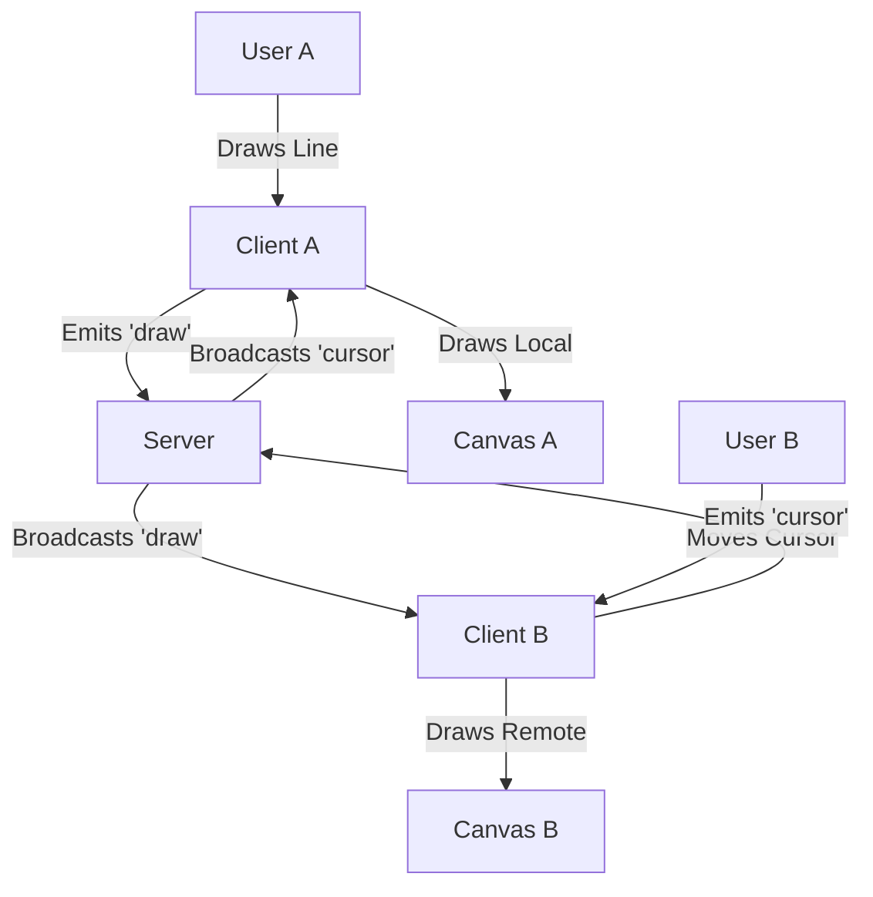

# Architecture & Design

## Data Flow Diagram

## Protocol (Socket.io Events)
- `join`: Client connects. Server sends `init_state` (full history).
- `draw`: Payload `{ x0, y0, x1, y1, color, size }`. Server appends to history and broadcasts.
- `cursor`: Payload `{ x, y, userId }`. Server broadcasts (does not store history).
- `undo`: Server removes last action from history, broadcasts `state_update` (full redraw or undo ID).

## Undo/Redo Strategy
**"Global Undo"**
1. The server maintains a linear list of all operations: `history = [op1, op2, op3]`.
2. When a user clicks Undo, we send an `undo` event.
3. Server pops the last operation: `history.pop()`.
4. Server triggers a `sync` event to all clients with the new history (or just the change).
5. **Naive but robust approach**: For this project, re-drawing the canvas from history on Undo is acceptable and safest to ensure consistency. It avoids complex bitmap manipulation.
   - *Optimization*: If history gets too long, we could cache a "snapshot" image.

**"Global Redo"**
1. Server maintains a temporary `redoStack`.
2. Undo actions move from `history` -> `redoStack`.
3. New drawing actions **clear** the `redoStack`.
4. Redo actions move from `redoStack` -> `history`.
5. **Note**: Redo availability is enforced server-side to maintain a single source of truth. UI buttons may remain active, but the server will ignore invalid requests.

## Conflict Resolution
- **Last Write Wins**: Since it's a creative canvas, if two people draw over the same pixel, the last event received by the server is the "top" layer.
- **Ordering**: Server assigns a sequence number (implied by array order) to every stroke.

## Performance Optimization Details

> [!NOTE]
> While this implementation uses direct event streaming, here is how we handle scale:

1.  **Coordinates Normalization**:
    We divide coordinates by window width/height (0.0 - 1.0). This ensures `x=0.5` is always the center, regardless of if the user is on a phone or 4K monitor.
2.  **Optimistic UI**:
    The client draws **immediately** on `mousedown`/`mousemove` without waiting for server confirmation. This makes drawing feel instant (0ms latency), even on slow networks.
3.  **Future Improvement - Event Batching**:
    Currently, every pixel movement emits an event. For production (1000+ users), we would batch these points into a single `stroke_segment` event every 50ms to reduce network packet overhead.
